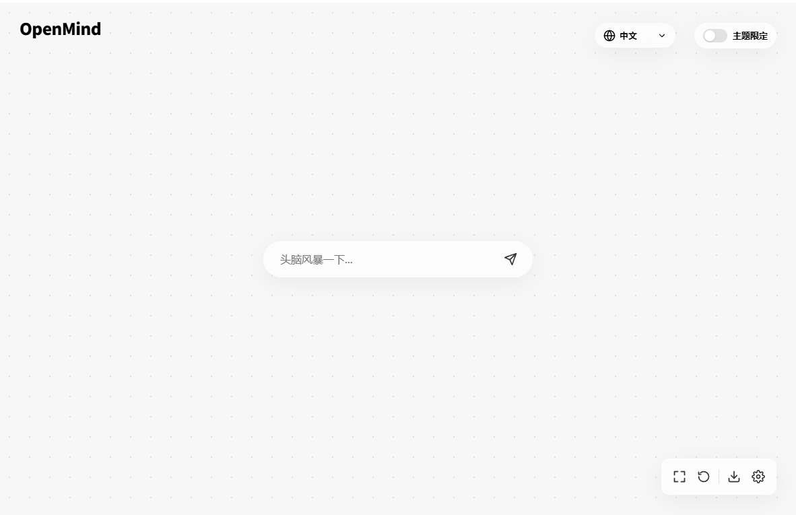
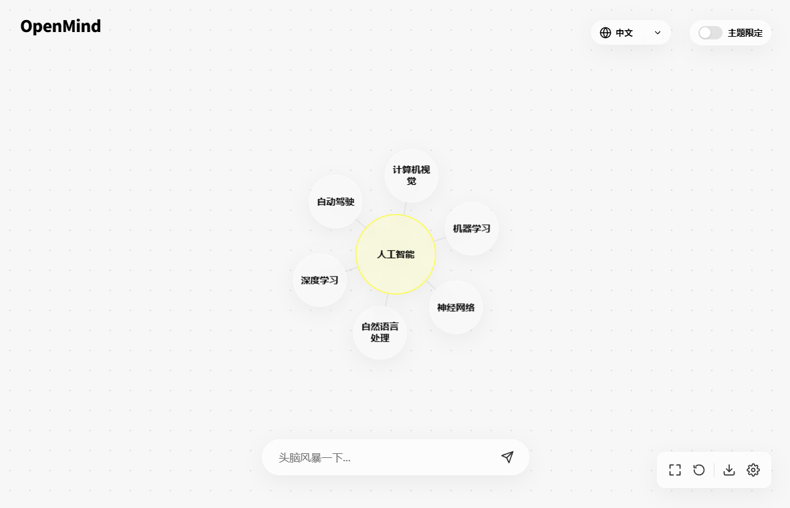

<div align="center">


# OpenMind

**AI 驱动的视觉化头脑风暴工具 | AI-Powered Visual Brainstorming Tool**

[](https://opensource.org/licenses/MIT)
[](https://vuejs.org/)
[](https://vitejs.dev/)
[](https://d3js.org/)

[English](#english) | [中文](#中文)

</div>

---

## 中文

### 📖 简介

OpenMind 是一个现代化的、基于 AI 驱动的**视觉化头脑风暴工具**。它将思维导图与大语言模型（LLM）深度结合，帮助你发现看似无关概念之间的隐秘联系，激发无限创意灵感。

通过交互式的力导向图和智能 AI 联想，OpenMind 让头脑风暴变得更加直观、高效和富有洞察力。

### ✨ 核心特性

#### 🎯 智能联想引擎

- **多模型支持**
  - **Google Gemini** - 强大的免费/付费模型，适合复杂推理
  - **DeepSeek** - 高性价比的中文语境优化模型
  - **本地 LLM** - 通过 Ollama/LMStudio 连接本地模型（如 Qwen、Llama 3），确保数据隐私
- **上下文联想** - 选择多个节点，AI 将基于所有选中关键词的上下文生成具有关联性的新灵感
- **概念桥接** - 智能连接看似无关的概念（如"艺术"与"科技"），发现创新交叉点

#### 🎨 极致体验

- **无限画布** - 基于 D3.js 的动态力导向图，支持无限缩放、平移和流畅的节点拖拽
- **现代美学** - Glassmorphism（毛玻璃）设计风格，配合精心调校的动画效果
- **多语模式** - 支持多语言头脑风暴
- **可配置性** - 自定义节点选择数量、关键词生成数量等参数

#### 🔧 实用功能

- **数据导出** - 将头脑风暴结果导出为结构化 JSON 文件
- **桌面应用** - 支持打包为 Electron 桌面应用
- **响应式设计** - 适配各种屏幕尺寸

### 🛠️ 技术栈

| 类别         | 技术                                         |
| ------------ | -------------------------------------------- |
| **前端框架** | Vue 3 (Composition API)                      |
| **构建工具** | Vite 7.x                                     |
| **可视化**   | D3.js (Force Simulation)                     |
| **样式**     | Modern CSS3 (CSS Variables, Backdrop-filter) |
| **桌面端**   | Electron                                     |
| **AI 集成**  | Google Generative AI SDK                     |

### 🚀 快速开始

#### 前置要求

- **Node.js** >= 16.0
- **npm** 或 **pnpm** 或 **yarn**

#### 安装步骤

1. **克隆仓库**

   ```bash
   git clone https://github.com/alanhaskey/OpenMind.git
   cd OpenMind
   ```

2. **安装依赖**

   ```bash
   npm install
   ```

3. **启动开发服务器**

   ```bash
   npm run dev
   ```

4. **访问应用**

   打开浏览器访问 [http://localhost:5173](http://localhost:5173)

#### 构建桌面应用（可选）

```bash
# 开发模式运行 Electron
npm run electron:dev

# 构建生产版本
npm run electron:build
```

### 📖 使用指南

#### 界面预览

<div align="center">


_主界面 - 无限画布与节点交互_


_多节点上下文联想_

</div>

#### 基础操作

1. **配置 API**

   - 点击右下角 **齿轮图标** 打开设置面板
   - 选择 AI 提供商（Gemini / DeepSeek / 本地模型）
   - 输入对应的 API Key 或配置本地模型地址
   - 调整节点选择数量、关键词生成数量等参数

2. **开始头脑风暴**

   - 在底部输入框输入**核心关键词**（如"未来"、"创新"）
   - **左键点击**节点 → AI 自动展开相关联想词
   - **右键点击**节点 → 选中节点（高亮显示），支持多选
   - **上下文生成** → 选中多个节点后点击展开，AI 将结合所有选中节点的语义进行智能发散

3. **画布操作**

   - **拖拽** - 移动单个节点
   - **滚轮** - 缩放画布
   - **拖拽空白** - 平移整个画布

4. **工具栏功能**
   - **A/文** - 切换显示语言（中文/英文/双语）
   - **下载图标** - 导出当前思维图谱为 JSON 文件
   - **垃圾桶图标** - 清空画布，重新开始

#### 高级技巧

- **概念桥接**：同时选中两个看似无关的概念（如"音乐"和"建筑"），让 AI 发现它们之间的创新连接点
- **层级探索**：从宏观概念逐步深入到具体细节，构建多层次的知识网络
- **导出与复用**：保存有价值的思维图谱，后续可以继续扩展

### ⚙️ 配置说明

#### API 提供商配置

**Google Gemini**

- 获取 API Key: [Google AI Studio](https://makersuite.google.com/app/apikey)
- 推荐模型: `gemini-2.0-flash-exp` 或 `gemini-1.5-pro`

**DeepSeek**

- 获取 API Key: [DeepSeek Platform](https://platform.deepseek.com/)
- 推荐模型: `deepseek-chat`

**本地模型**

- 安装 [Ollama](https://ollama.ai/) 或 [LM Studio](https://lmstudio.ai/)
- 配置本地 API 地址（默认: `http://localhost:11434`）
- 推荐模型: `qwen2.5`, `llama3.1`, `mistral`

#### 应用参数

| 参数           | 说明                         | 默认值 |
| -------------- | ---------------------------- | ------ |
| 节点选择数量   | 上下文联想时最多选择的节点数 | 6      |
| 关键词生成数量 | 每次 AI 生成的关键词数量     | 6      |

### 🤝 贡献指南

我们欢迎所有形式的贡献！

- 🐛 **报告 Bug** - 提交 [Issue](https://github.com/alanhaskey/OpenMind/issues)
- 💡 **功能建议** - 分享你的创意想法
- 🔧 **代码贡献** - 提交 Pull Request
- 📖 **文档改进** - 帮助完善文档
- 🎨 **Prompt 优化** - 分享更好的 AI Prompt 设计

### 📄 开源协议

本项目采用 [MIT License](LICENSE) 开源协议。

### 🙏 致谢

- [Vue.js](https://vuejs.org/) - 渐进式 JavaScript 框架
- [D3.js](https://d3js.org/) - 强大的数据可视化库
- [Google Gemini](https://ai.google.dev/) - 先进的大语言模型
- [DeepSeek](https://www.deepseek.com/) - 高性价比的 AI 模型

---

## English

### 📖 Introduction

OpenMind is a modern, **AI-powered visual brainstorming tool** that combines mind mapping with Large Language Models (LLMs) to help you discover hidden connections between seemingly unrelated concepts and spark unlimited creativity.

Through interactive force-directed graphs and intelligent AI associations, OpenMind makes brainstorming more intuitive, efficient, and insightful.

### ✨ Key Features

#### 🎯 Intelligent Association Engine

- **Multi-Model Support**
  - **Google Gemini** - Powerful free/paid models for complex reasoning
  - **DeepSeek** - Cost-effective model optimized for Chinese context
  - **Local LLM** - Connect local models via Ollama/LMStudio (e.g., Qwen, Llama 3) for data privacy
- **Contextual Association** - Select multiple nodes, AI generates new insights based on all selected keywords
- **Concept Bridging** - Intelligently connect seemingly unrelated concepts (e.g., "Art" & "Technology")

#### 🎨 Premium Experience

- **Infinite Canvas** - D3.js-based dynamic force-directed graph with infinite zoom, pan, and smooth node dragging
- **Modern Aesthetics** - Glassmorphism design with carefully tuned animations
- **Language Mode** - Support multiple languages for brainstorming
- **Customizable** - Configure node selection limits, keyword generation counts, and more

#### 🔧 Practical Features

- **Data Export** - Export brainstorming results as structured JSON files
- **Desktop App** - Package as Electron desktop application
- **Responsive Design** - Adapts to various screen sizes

### 🛠️ Tech Stack

| Category           | Technology                                   |
| ------------------ | -------------------------------------------- |
| **Frontend**       | Vue 3 (Composition API)                      |
| **Build Tool**     | Vite 7.x                                     |
| **Visualization**  | D3.js (Force Simulation)                     |
| **Styling**        | Modern CSS3 (CSS Variables, Backdrop-filter) |
| **Desktop**        | Electron                                     |
| **AI Integration** | Google Generative AI SDK                     |

### 🚀 Quick Start

#### Prerequisites

- **Node.js** >= 16.0
- **npm** or **pnpm** or **yarn**

#### Installation

1. **Clone the repository**

   ```bash
   git clone https://github.com/alanhaskey/OpenMind.git
   cd OpenMind
   ```

2. **Install dependencies**

   ```bash
   npm install
   ```

3. **Start development server**

   ```bash
   npm run dev
   ```

4. **Access the app**

   Open your browser and visit [http://localhost:5173](http://localhost:5173)

#### Build Desktop App (Optional)

```bash
# Run Electron in development mode
npm run electron:dev

# Build production version
npm run electron:build
```

### 📖 Usage Guide

#### Interface Preview

<div align="center">


_Main Interface - Infinite Canvas & Node Interaction_


_Multi-Node Contextual Association_

</div>

#### Basic Operations

1. **Configure API**

   - Click the **gear icon** in the bottom-right corner
   - Select AI provider (Gemini / DeepSeek / Local Model)
   - Enter the corresponding API Key or configure local model address
   - Adjust node selection limit, keyword generation count, etc.

2. **Start Brainstorming**

   - Enter a **core keyword** in the bottom input box (e.g., "Future", "Innovation")
   - **Left-click** a node → AI automatically expands related associations
   - **Right-click** a node → Select node (highlighted), supports multi-selection
   - **Contextual Generation** → After selecting multiple nodes, click to expand, AI will intelligently diverge based on all selected nodes' semantics

3. **Canvas Operations**

   - **Drag** - Move individual nodes
   - **Scroll** - Zoom canvas
   - **Drag empty space** - Pan entire canvas

4. **Toolbar Functions**
   - **A/文** - Toggle display language (Chinese/English/Bilingual)
   - **Download icon** - Export current mind map as JSON file
   - **Trash icon** - Clear canvas and start over

#### Advanced Tips

- **Concept Bridging**: Select two seemingly unrelated concepts (e.g., "Music" and "Architecture"), let AI discover innovative connections
- **Hierarchical Exploration**: Gradually dive from macro concepts to specific details, building multi-level knowledge networks
- **Export & Reuse**: Save valuable mind maps for future expansion

### ⚙️ Configuration

#### API Provider Setup

**Google Gemini**

- Get API Key: [Google AI Studio](https://makersuite.google.com/app/apikey)
- Recommended models: `gemini-2.0-flash-exp` or `gemini-1.5-pro`

**DeepSeek**

- Get API Key: [DeepSeek Platform](https://platform.deepseek.com/)
- Recommended model: `deepseek-chat`

**Local Models**

- Install [Ollama](https://ollama.ai/) or [LM Studio](https://lmstudio.ai/)
- Configure local API address (default: `http://localhost:11434`)
- Recommended models: `qwen2.5`, `llama3.1`, `mistral`

#### Application Parameters

| Parameter                | Description                              | Default |
| ------------------------ | ---------------------------------------- | ------- |
| Node Selection Limit     | Max nodes for contextual association     | 6       |
| Keyword Generation Count | Number of keywords generated per AI call | 6       |

### 🤝 Contributing

We welcome all forms of contributions!

- 🐛 **Report Bugs** - Submit an [Issue](https://github.com/alanhaskey/OpenMind/issues)
- 💡 **Feature Requests** - Share your creative ideas
- 🔧 **Code Contributions** - Submit Pull Requests
- 📖 **Documentation** - Help improve documentation
- 🎨 **Prompt Optimization** - Share better AI prompt designs

### 📄 License

This project is licensed under the [MIT License](LICENSE).

### 🙏 Acknowledgments

- [Vue.js](https://vuejs.org/) - The Progressive JavaScript Framework
- [D3.js](https://d3js.org/) - Powerful data visualization library
- [Google Gemini](https://ai.google.dev/) - Advanced large language model
- [DeepSeek](https://www.deepseek.com/) - Cost-effective AI model

---

<div align="center">

**Made with ❤️ by the OpenMind Team**

[⭐ Star this repo](https://github.com/alanhaskey/OpenMind) | [🐛 Report Bug](https://github.com/alanhaskey/OpenMind/issues) | [💡 Request Feature](https://github.com/alanhaskey/OpenMind/issues)

</div>
