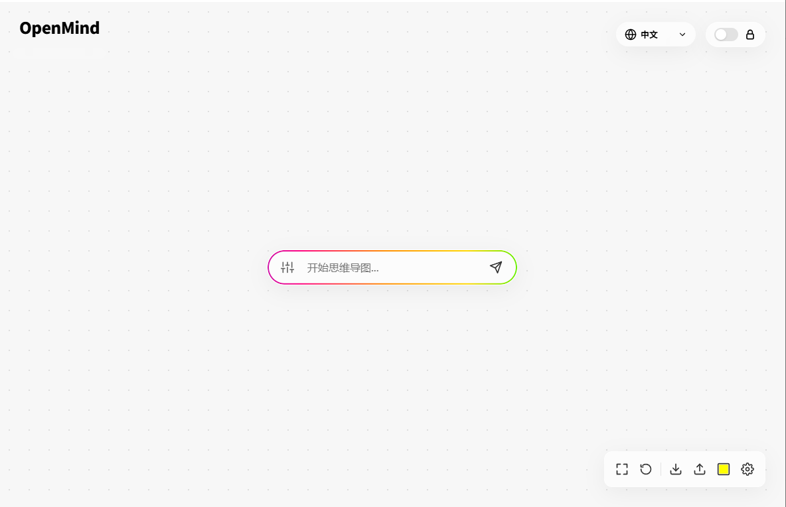
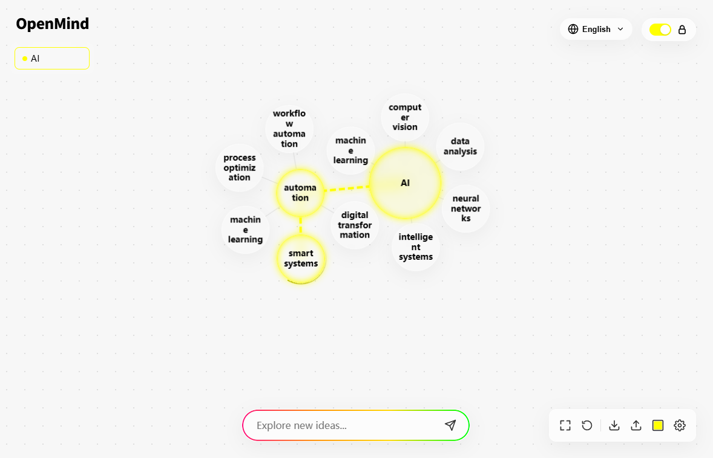

<div align="center">


# OpenMind

**AI 驱动的视觉化头脑风暴工具 | AI-Powered Visual Brainstorming Tool**

[](https://opensource.org/licenses/MIT)
[](https://vuejs.org/)
[](https://vitejs.dev/)
[](https://d3js.org/)
[](https://github.com/alanhaskey/OpenMind)

[English](#english) | [中文](#中文)

</div>

---

## 中文

### 📖 简介

OpenMind 是一个现代化的、基于 AI 驱动的**视觉化头脑风暴工具**。它将思维导图与大语言模型（LLM）深度结合，帮助你发现看似无关概念之间的隐秘联系，激发无限创意灵感。

通过交互式的力导向图和智能 AI 联想，OpenMind 让头脑风暴变得更加直观、高效和富有洞察力。

### ✨ 核心特性

#### 🎯 智能联想引擎

- **多模型支持**
  - **Google Gemini** - 强大的免费/付费模型，适合复杂推理
  - **DeepSeek** - 高性价比的中文语境优化模型
  - **本地 LLM** - 通过 Ollama/LMStudio 连接本地模型（如 Qwen, Llama 3），确保数据隐私
- **上下文联想** - 选择多个节点，AI 将基于所有选中关键词的上下文生成具有关联性的新灵感
- **概念桥接** - 智能连接看似无关的概念（如"艺术"与"科技"），发现创新交叉点

#### 🎨 极致体验

- **无限画布** - 基于 D3.js 的动态力导向图，支持无限缩放、平移
- **高性能渲染** - 采用视口剔除（Viewport Culling）技术，即使 100+ 节点也能保持丝般顺滑
- **现代美学** - Glassmorphism（毛玻璃）设计风格，配合精心调校的“气泡弹出”与“流光”动画
- **多语模式** - 支持多语言头脑风暴
- **高度定制** - 可自定义节点选择上限、关键词生成数量、主题颜色等

#### 🔧 实用功能

- **数据导出** - 将头脑风暴结果导出为结构化 JSON 文件，方便二次编辑
- **桌面应用** - 基于 Electron 构建，提供原生应用体验
- **响应式设计** - 完美适配各种屏幕尺寸

### 🚀 快速开始

#### 前置要求

- **Node.js** >= 16.0
- **npm** 或 **pnpm** 或 **yarn**

#### 安装步骤

1. **克隆仓库**

   ```bash
   git clone https://github.com/alanhaskey/OpenMind.git
   cd OpenMind
   ```

2. **安装依赖**

   ```bash
   npm install
   ```

3. **启动开发服务器**

   ```bash
   npm run dev
   ```

4. **访问应用**

   打开浏览器访问 [http://localhost:5173](http://localhost:5173)

### 📖 使用指南

#### 界面预览

<div align="center">


_主界面 - 无限画布与节点交互_


_多节点上下文联想_

</div>

#### 基础操作

1. **配置 API**
   - 点击右下角 **齿轮图标** 打开设置面板
   - 选择 AI 提供商并配置 API Key
2. **开始头脑风暴**
   - 底部输入框输入**核心关键词**
   - **左键点击**节点 → AI 自动展开联想
   - **右键点击**节点 → 多选节点进行上下文联想
3. **画布操作**
   - **拖拽**节点 / **滚轮**缩放 / **拖拽空白**平移

### 🛠️ 技术栈

| 类别         | 技术                                         |
| ------------ | -------------------------------------------- |
| **前端框架** | Vue 3 (Composition API)                      |
| **构建工具** | Vite 7.x                                     |
| **可视化**   | D3.js (Force Simulation)                     |
| **样式**     | Modern CSS3 (CSS Variables, Backdrop-filter) |
| **桌面端**   | Electron                                     |
| **AI 集成**  | Google Generative AI SDK, OpenAI Compatible  |

---

## English

### 📖 Introduction

OpenMind is a modern, **AI-powered visual brainstorming tool** that combines mind mapping with Large Language Models (LLMs) to help you discover hidden connections between seemingly unrelated concepts and spark unlimited creativity.

### ✨ Key Features

#### 🎯 Intelligent Association Engine

- **Multi-Model Support**: Google Gemini, DeepSeek, and Local LLMs (Ollama/LMStudio)
- **Contextual Association**: Generate insights based on multiple selected keywords
- **Concept Bridging**: Connect unrelated concepts to find innovative intersections

#### 🎨 Premium Experience

- **Infinite Canvas**: D3.js-based force-directed graph with infinite zoom/pan
- **High Performance**: Optimized with Viewport Culling for smooth rendering of 100+ nodes
- **Modern Aesthetics**: Glassmorphism design with polished animations
- **Customizable**: Configurable limits, colors, and more

### 🚀 Quick Start

1. **Clone & Install**

   ```bash
   git clone https://github.com/alanhaskey/OpenMind.git
   cd OpenMind
   npm install
   ```

2. **Run**
   ```bash
   npm run dev
   ```
   Visit `http://localhost:5173`

### 🛠️ Tech Stack

- **Frontend**: Vue 3, Vite 7.x
- **Viz**: D3.js
- **Desktop**: Electron
- **AI**: Google Gemini SDK, OpenAI Compatible APIs

---

<div align="center">

**Made with ❤️ by the OpenMind Team**

[⭐ Star this repo](https://github.com/alanhaskey/OpenMind) | [🐛 Report Bug](https://github.com/alanhaskey/OpenMind/issues)

</div>
